# Omelette 🍳


Omelette is a macOS menu bar app for AI coding usage: Claude, Codex, Antigravity/Gemini and Grok limits, local CLI cost accounting, and the agent sessions that need you.
This README is a map. Each section says what it covers and points to the next one.

> **Why "Omelette"?** While reverse-engineering the usage API we found that
> Anthropic's internal codename for Claude Design is `omelette` (the weekly
> window arrives as `seven_day_omelette`). The name was too good to leave
> buried in a JSON key.

## Contents

- [Screenshots](#screenshots)
- [What it shows](#what-it-shows)
- [Popover](#popover)
- [Agents at a glance](#agents-at-a-glance)
- [Command line and MCP](#command-line-and-mcp)
- [Dashboard](#dashboard)
- [Notifications](#notifications)
- [Widgets and floating window](#widgets-and-floating-window)
- [Settings](#settings)
- [How it works](#how-it-works)
- [Requirements](#requirements)
- [Install](#install)
- [Build from source](#build-from-source)
- [Disclaimer](#disclaimer)
- [License](#license)

## Screenshots

The popover and the dashboard, one shot of each below. More of both live in the
two disclosures underneath.

<table>
  <tr>
    <td width="36%">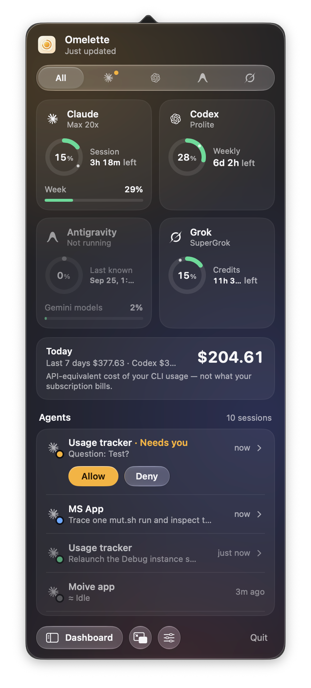</td>
    <td width="64%">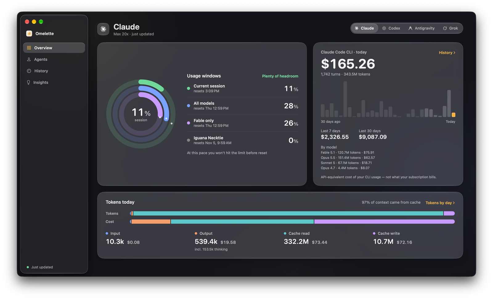</td>
  </tr>
  <tr>
    <td>The popover, All tab. An agent asked a question, so its row got Allow / Deny.</td>
    <td>Dashboard Overview. Tokens today: input, output (with thinking), cache read, cache write, and dollars per category.</td>
  </tr>
</table>

<details>
<summary><b>More of the popover</b>: one tab per provider, last-known numbers when one is closed</summary>
<br>
<table>
  <tr>
    <td>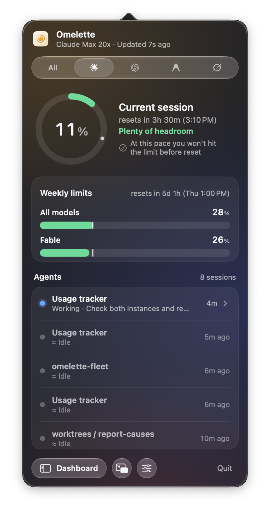</td>
    <td>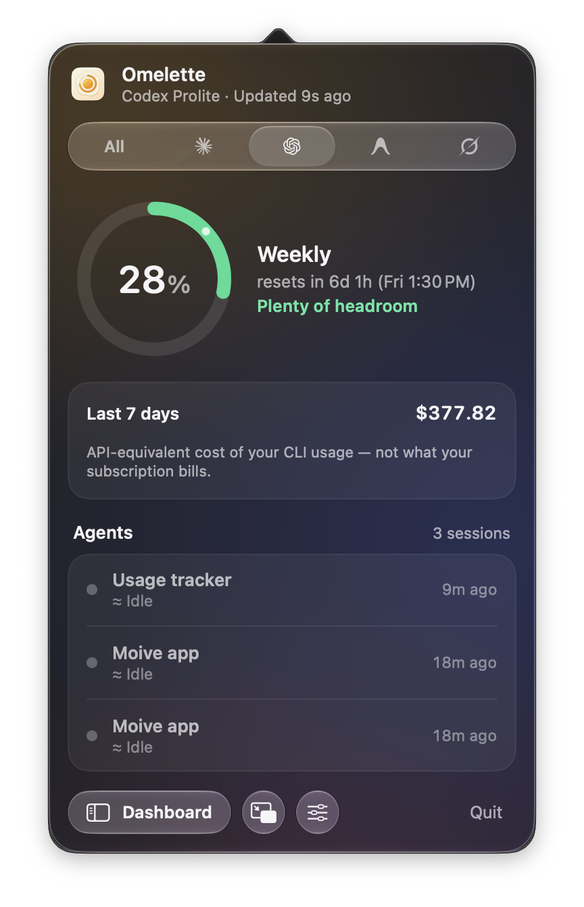</td>
    <td>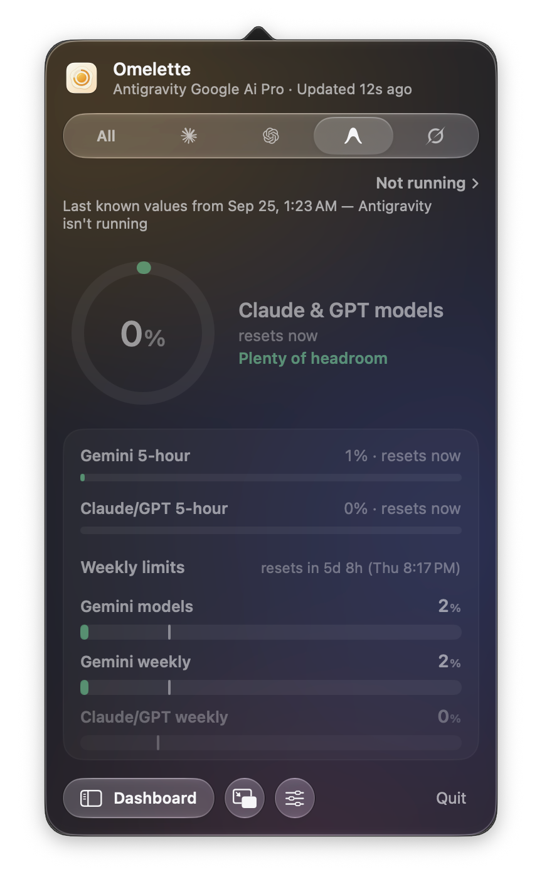</td>
    <td>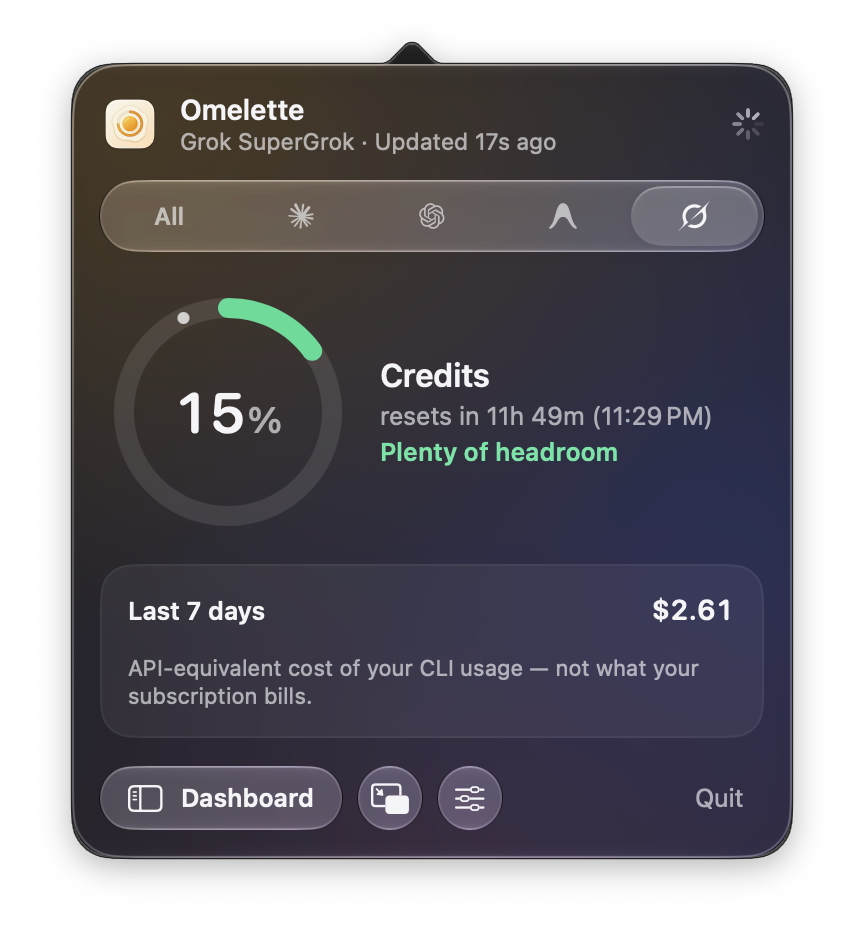</td>
  </tr>
  <tr>
    <td>Claude</td><td>Codex</td><td>Antigravity, closed: last known values, dimmed</td><td>Grok</td>
  </tr>
</table>
</details>

<details>
<summary><b>More of the dashboard</b>: overview per provider, history in dollars or tokens, quota history, activity, agents, insights</summary>
<br>
<table>
  <tr>
    <td>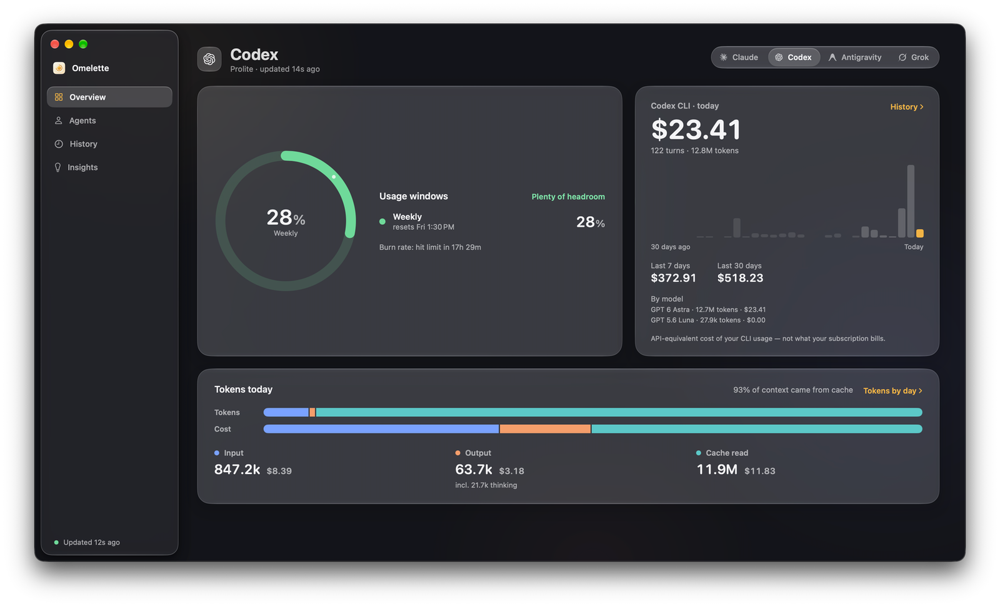</td>
    <td>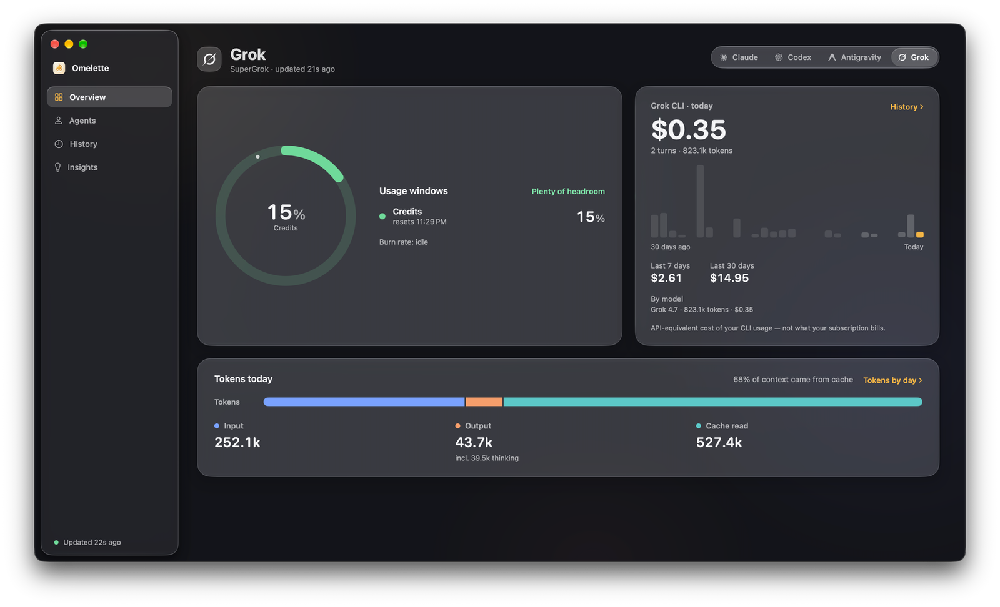</td>
  </tr>
  <tr><td>Overview, Codex</td><td>Overview, Grok</td></tr>
  <tr>
    <td>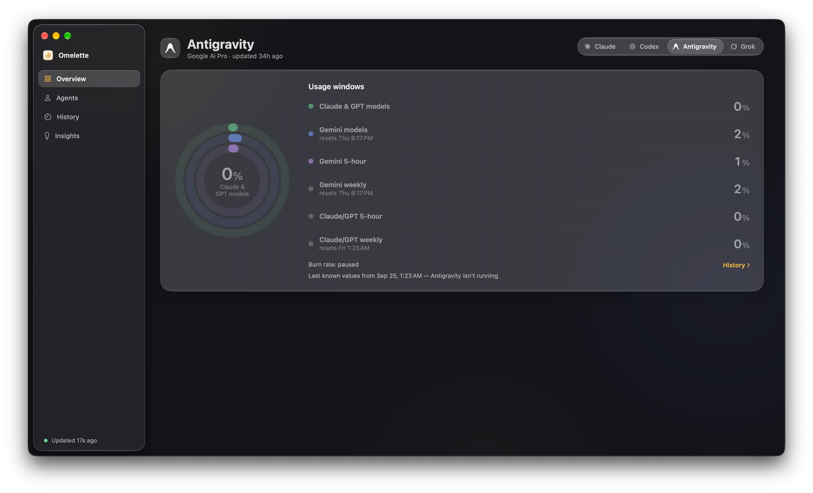</td>
    <td>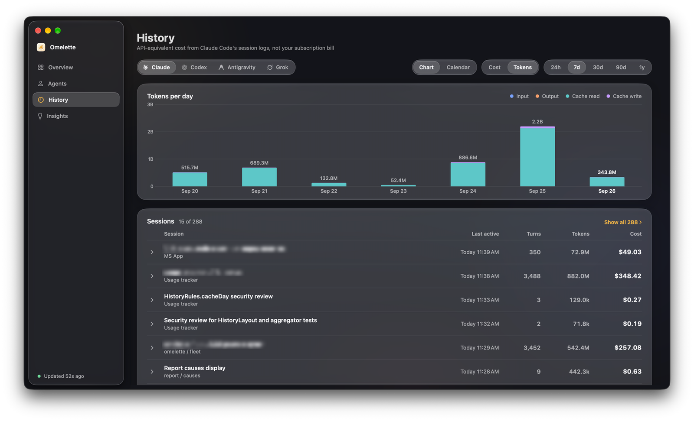</td>
  </tr>
  <tr><td>Overview, Antigravity closed: last known values</td><td>History, Tokens mode</td></tr>
  <tr>
    <td>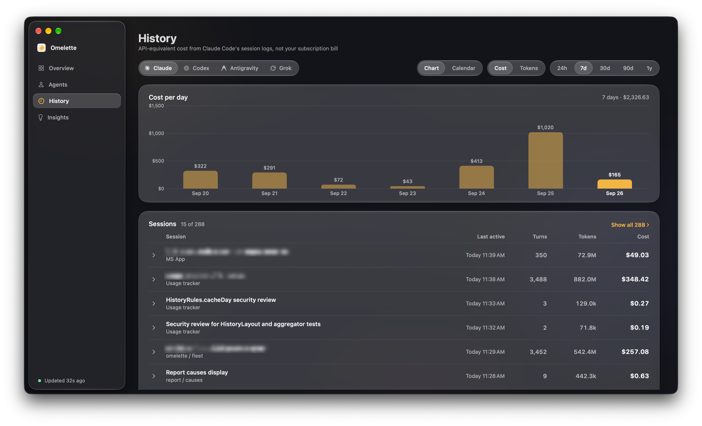</td>
    <td>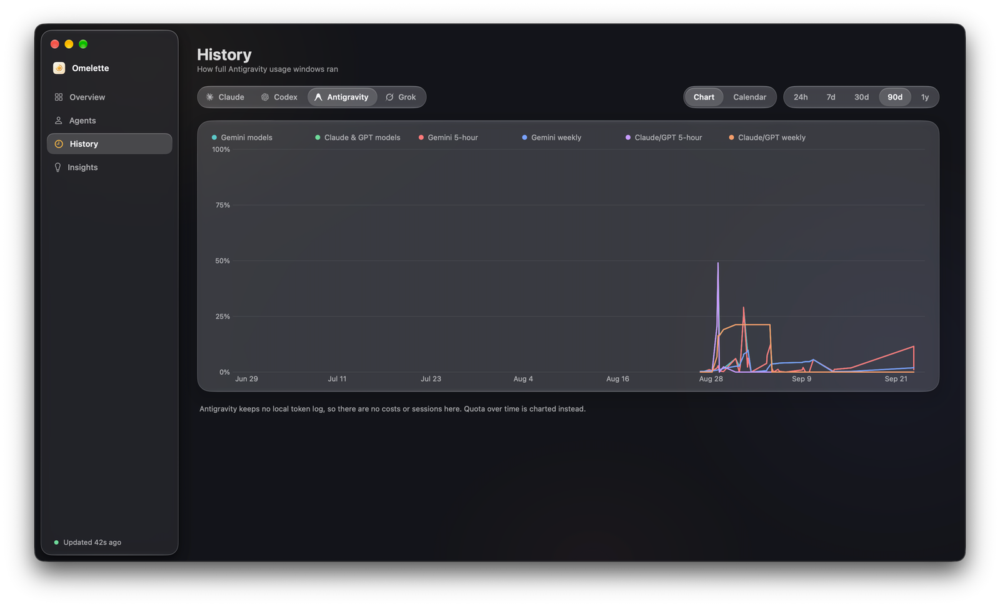</td>
  </tr>
  <tr><td>History, Cost mode</td><td>Quota history for a provider without a token log</td></tr>
  <tr>
    <td>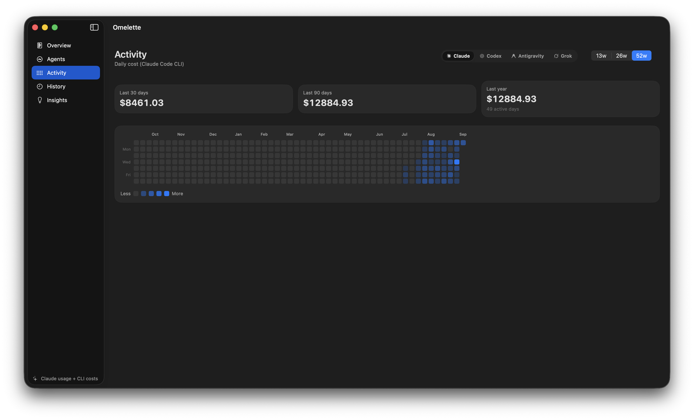</td>
    <td>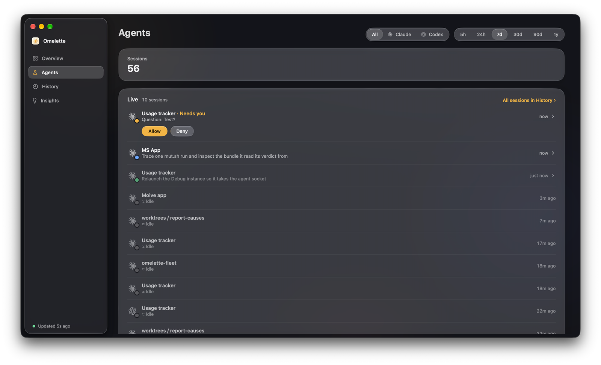</td>
  </tr>
  <tr><td>Activity</td><td>Agents: live sessions and run history</td></tr>
  <tr>
    <td colspan="2">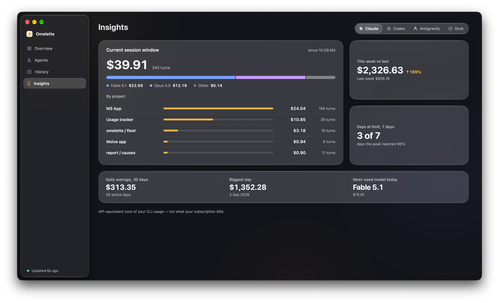</td>
  </tr>
  <tr><td colspan="2">Insights: what filled the current session window, ranked by project</td></tr>
</table>
</details>

Next: [What it shows](#what-it-shows).

## What it shows

If you use Claude Code, Codex, Gemini CLI, Antigravity or Grok, this is the
one place that shows where you stand across all of them, so a rate limit
never catches you mid-task.

| Provider | What you see |
|---|---|
| **Claude** | 5-hour session and weekly limits per model, decoded dynamically so a new model appears without an update; extra usage credits; Enterprise spend limits |
| **Codex (OpenAI)** | session and weekly limits from the local Codex CLI; local dollar cost accounting from its session logs, now including compaction calls and sessions moved to `~/.codex/archived_sessions` |
| **Gemini CLI / Antigravity** | Gemini CLI's daily model quotas using its Google sign-in, or Antigravity's model-pool quotas, the path for personal Google accounts |
| **Grok (xAI)** | billing-period credit usage from the local Grok CLI, falling back to grok.com web billing when the CLI is unavailable |

- Costs come from local logs at models.dev list prices, never invented
  numbers. They are always API-equivalent, never your subscription bill
- In Claude Code's logs, a sub-agent's spend is attributed to the project
  that launched it
- **Last known numbers.** A provider that's closed or signed out keeps its
  last good reading, dimmed, with "as of 14:05" on the chip, on every
  surface (All tab, popover, dashboard, menu bar, widgets). A **Forget last
  known numbers** button per provider in Settings clears it on demand
- **Pay-as-you-go mode.** Accounts without rate windows get a "$ spent"
  pill and an optional weekly budget with percentage bars and alerts

Next: [Popover](#popover).

## Popover

Click the menu bar icon. Every provider on one tab (`All`), or one at a time
on its own tab.

- **All-tab tiles lead with the 5-hour session window**, the number people
  open the popover to check, with the weekly window on the line below
- **The cost tile shows today's spend first**, with the 7-day total and the
  per-provider split underneath
- **Spend-limit and extra-usage providers show both dollar amounts under the
  ring** ("$431 of $1,500"), not a bare percentage
- **Footer**: Dashboard, floating window, Settings and Refresh buttons, plus
  the app version linking to the GitHub page (drops to its own line at
  narrow widths, so Quit is never pushed off)

Next: [Agents at a glance](#agents-at-a-glance).

## Agents at a glance

The popover doubles as a control panel for the Claude Code and Codex
sessions you already have running.

- **Live sessions**: every session, grouped *Needs you / Working / Done /
  Idle*, with the project and what it's doing
- **Needs you** covers three things: a permission request, a question
  (`AskUserQuestion`), or a plan waiting for approval. Each shows the real
  text (the question's options, the plan's opening lines), one click away
- **Allow / Deny** from the notification and from the session's row, when
  its terminal isn't in front. Held for two minutes, then released
  untouched to the terminal if you don't answer; when the terminal is
  already in front, the CLI just asks there
- **Hooks for both CLIs**: eight Claude Code hooks in
  `~/.claude/settings.json`, seven Codex hooks in `~/.codex/hooks.json`,
  installed with one click (Settings → Agents shows the exact JSON first).
  Codex refuses a hook until you trust it once with `/hooks` inside Codex;
  Settings → Agents says when that's still outstanding
- **Jump to the tab**: clicking a row brings its terminal back. Terminal and
  iTerm2 select the exact tab; cmux selects the exact workspace and surface
  over its own socket; Ghostty, Warp, kitty, Alacritty, WezTerm, VS Code, VS
  Code Insiders, Cursor and Windsurf all come to the front

Finished sessions and run history live in the dashboard's
[Agents tab](#dashboard).

Next: [Command line and MCP](#command-line-and-mcp).

## Command line and MCP

A tiny `omelette` tool ships inside the app, for the terminal and for your
agents.

| Command | What it prints |
|---|---|
| `omelette status` | every provider's windows with exact reset times, today's and this week's cost, what your agents are doing |
| `omelette status --json` | the same snapshot as JSON, including each provider's recent chats |
| `omelette statusline [--provider ID]` | one line for a status bar (default: claude) |
| `omelette mcp` | a read-only MCP server on stdio |
| `omelette --version` / `--help` | version and usage |

`omelette statusline` installs with one click from Settings → General →
Command line: `◐ 42% · resets in 1h 10m · $4.20 today · ⚑ 1`. Or add it
yourself to `~/.claude/settings.json` (Claude Code runs the command through a
shell, so `$HOME` expands):

```json
{
  "statusLine": {
    "type": "command",
    "command": "\"$HOME/Library/Application Support/UsageTracker/bin/omelette\" statusline",
    "refreshInterval": 60
  }
}
```

`refreshInterval` re-runs the command on a timer as well as on Claude Code's
own events, so the countdown keeps ticking while the session is idle. The
one-click install writes it too.

`omelette mcp` answers three tools. Nothing is written, nothing leaves your
Mac.

| Tool | Arguments | Returns |
|---|---|---|
| `get_usage` | none | every provider's windows, resets and costs |
| `get_agents` | none | which sessions are working or waiting on you |
| `get_sessions` | `provider` (`claude` or `codex`, optional), `limit` (1-15, default 10) | the recent chats: title, project, last active, turns, tokens, cost, sub-agent count |

- One-click install for Claude Code (adds `omelette` to `~/.claude.json`)
  and Codex (adds an `[mcp_servers.omelette]` table to
  `~/.codex/config.toml`) from that same Settings section
- Or add it by hand:
  ```bash
  claude mcp add omelette -- "$HOME/Library/Application Support/UsageTracker/bin/omelette" mcp
  ```
  or, in `~/.codex/config.toml`:
  ```toml
  [mcp_servers.omelette]
  command = "/Users/you/Library/Application Support/UsageTracker/bin/omelette"  # full path, no $HOME
  args = ["mcp"]
  ```
- What an agent does with `get_usage`: before a long task it asks and waits
  for the reset, or picks a cheaper model. `get_sessions` is for a person
  checking what an agent has been doing and spending

Next: [Dashboard](#dashboard).

## Dashboard

A separate window, per provider, built from the same local logs. Opens from
the popover footer or ⌘D.

- **Overview**: the leading window as a ring with the burn verdict, and the
  day's cost; a spend-limit provider shows both dollar amounts under the
  ring here too
- **Tokens today**: input, output, cache read, cache write and (nested
  under output) thinking, plus the share of context that came from cache
- **History**: a Cost / Tokens / **Sessions** switch. Sessions lists your
  last 10 chats plus the 5 most expensive, for Claude Code and Codex:
  title, project, tokens and cost, expandable to the input/output/cache
  split, the sub-agents it launched, and a per-day breakdown. "Show all"
  reveals every chat with a Recent / Cost sort
- **Insights**: top project, week-over-week change, peak day, busiest hour
- **Activity**: a GitHub-style heatmap of the last 52 weeks
- **Agents tab**: live sessions plus the run history: sessions, agent
  time, approval requests and busiest project over the range you pick,
  finished sessions grouped by day
- The sidebar footer names the data source and the app version, linking to
  the GitHub page
- Every dollar figure here is the API-equivalent cost of your CLI usage,
  not what your subscription bills, except on a pay-as-you-go account,
  where it's the real bill

Next: [Notifications](#notifications).

## Notifications

- **Threshold alerts** at 80% and 95% (configurable), with quiet-hours support
- **Session-timing alerts**: "burning fast" (would hit the limit before
  the window resets) and "resets soon"
- **Daily summary**: wake up to "Yesterday: $4.20 across 23 turns"
- **Agent banners**: "needs you" (ignores quiet hours by default, opt-out)
  and "finished a turn" (opt-in), each naming its source ("Claude Code" or
  "Codex")

Next: [Widgets and floating window](#widgets-and-floating-window).

## Widgets and floating window

- **Desktop widgets**: per-provider Small / Medium / Large (right-click →
  Edit Widget to pick the provider) and an "All providers" overview widget
- **Floating mini window**: always-on-top, dockable to a corner, shows
  the leading window as a ring plus how many agent sessions are running

Next: [Settings](#settings).

## Settings

- **General**: refresh interval, menu bar (percentage mode, per-provider
  visibility), the global peek shortcut, launch at login, provider toggles
  with Forget last known numbers, Command line (PATH, status line, MCP
  server, both installers above), and a "Show remaining instead of used"
  switch that turns every ring, bar and percent around
- **Notifications**: threshold %, session timing, quiet hours, daily summary
- **Agents**: hooks status and install for Claude Code and Codex (with the
  Codex trust line), the Codex `notify` line, alert toggles, the Allow/Deny
  switch with its pending/answered/expired counts, socket diagnostics
- **Account**: connected services, keychain access, optional Admin API
  key, pay-as-you-go weekly budget
- **Advanced**: override the `anthropic-beta` OAuth header, replay the
  welcome tour, force a refresh, reset all settings

Next: [How it works](#how-it-works).

## How it works

Reads the OAuth token that **Claude Code** stores in your macOS Keychain
(item name `Claude Code-credentials`) and calls
`https://api.anthropic.com/api/oauth/usage`, the same undocumented endpoint
Claude Code itself uses for its `/usage` command and status line. Omelette
never refreshes that token itself; Claude Code owns its own refresh cycle.
Other providers are read the same reuse-what's-already-there way: the local
Codex CLI's RPC server, a running Antigravity's local language server, the
Gemini CLI's Google sign-in, or the local Grok CLI (with a grok.com fallback).

- Uses only your own credentials, already obtained by the tools themselves.
  It never asks you to log in anywhere
- Talks only to: `api.anthropic.com` (usage endpoint, plus Enterprise cost
  reports if you add an Admin API key), `models.dev` (public pricing data),
  `cloudcode-pa.googleapis.com` (Gemini quota, only if enabled),
  `grok.com` (Grok web-billing fallback, only if enabled), `github.com` and
  `adxd-og.github.io` (Sparkle update feed and DMG download), and local RPC
  to the Codex CLI or Antigravity's language server
- Agent status comes from a tiny `omelette-hook` helper inside the app that
  Claude Code and Codex run on their hook events. It talks to Omelette over
  a local Unix socket (0600, 64 KB cap) and forwards only the session id,
  tool name, a truncated summary, folder and host process, never prompts
  or file contents. Every hook exits within 0.8 s except a permission
  request, which the helper holds open for up to 140 s so Omelette can
  answer Allow/Deny; a helper that gets no reply always fails safe
- The `omelette` command-line tool and MCP server only ever read
  `~/Library/Application Support/UsageTracker/status.json`, written after
  every poll. They never start the app, open a socket, or touch the network
- Polls at human-paced intervals (default 60s), honours server `Retry-After`
- **No telemetry, no analytics.** Usage history and cost accounting stay
  on your Mac
- Open source end to end. Audit anything above

Next: [Requirements](#requirements).

## Requirements

- macOS 14 (Sonoma) or newer. Liquid Glass activates on macOS 26 Tahoe+
- [Claude Code](https://docs.anthropic.com/claude-code) installed and
  signed in (`claude login`)
- Works with Pro / Max / Team / Enterprise subscriptions **and**
  pay-as-you-go Enterprise accounts
- Optional: Codex CLI (ChatGPT sign-in), Gemini CLI or Antigravity (Google
  sign-in), and/or Grok CLI (xAI sign-in) for their providers
- No extra setup for the terminal: Terminal, iTerm2, cmux and every other
  supported host work out of the box

Next: [Install](#install).

## Install

1. Download the latest `Omelette.dmg` from [Releases](../../releases)
2. Open the DMG and drag `Omelette.app` to `~/Applications/` (or `/Applications/`).
   Upgrading from Usage Checker ≤ 1.5? Delete the old `UsageChecker.app` first.
   Settings, history and widgets carry over automatically
3. Launch it. macOS asks for permission to read the `Claude Code-credentials`
   Keychain item: click **Always Allow**. From then on Omelette works off its
   own copy and never raises that dialog from a background refresh. It can
   reappear after something resets the item's access list (a reinstall, or a
   differently signed build); Settings → Account → **Request keychain access
   now** brings it back on demand
4. The icon appears in your menu bar; click it to see usage
5. That's the last manual install. Updates arrive automatically via Sparkle
   (signed & notarized), or on demand via Settings → **Check for updates now**

Next: [Build from source](#build-from-source).

## Build from source

See [CONTRIBUTING.md](CONTRIBUTING.md).

TL;DR:
```bash
brew install xcodegen
./scripts/setup.sh      # creates signing.xcconfig from the example
./scripts/build_dmg.sh
```

Next: [Disclaimer](#disclaimer).

## Disclaimer

`/api/oauth/usage` is an **undocumented** endpoint that the official Claude Code CLI uses internally. Anthropic may change or remove it at any time. If that happens, this widget will gracefully show "Error" until it's updated.

Omelette is **not** affiliated with or endorsed by Anthropic. The name is an
affectionate nod to a codename in their API, nothing more.

## License

[MIT](LICENSE). Do what you like, no warranty.
